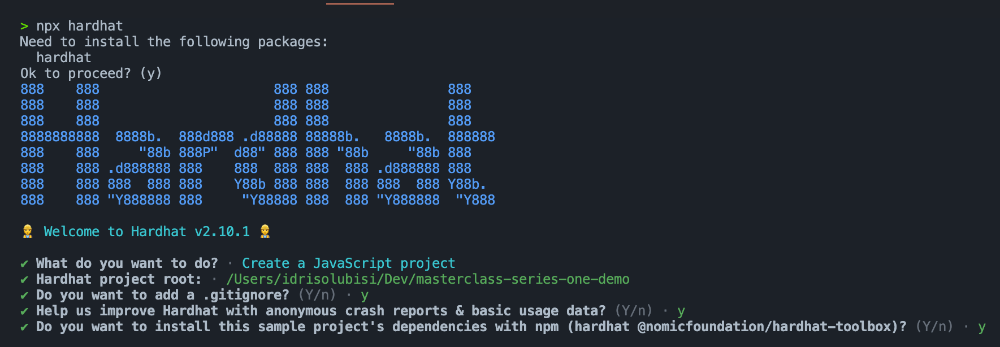
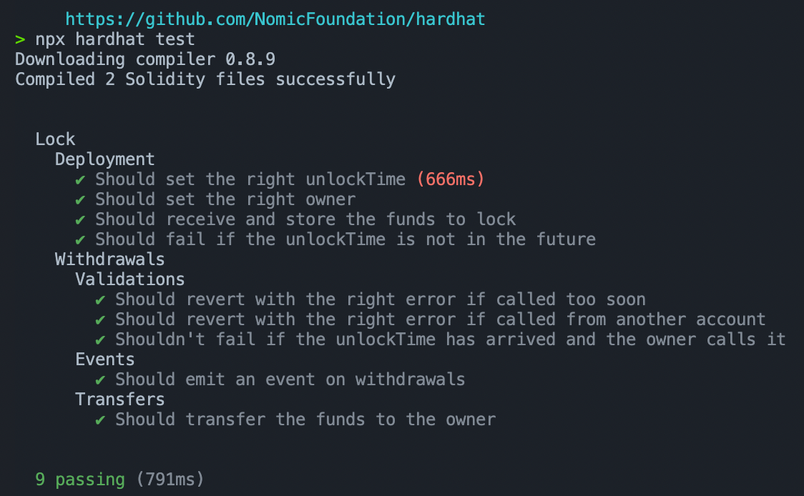
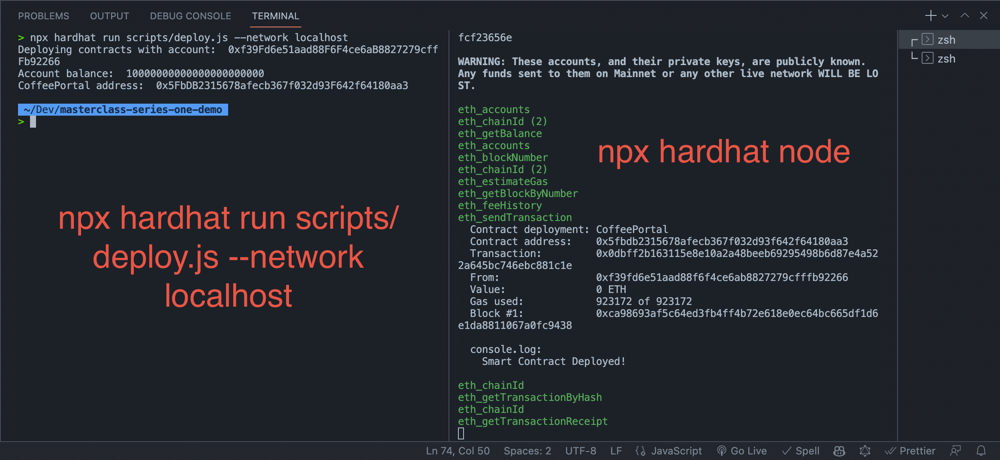
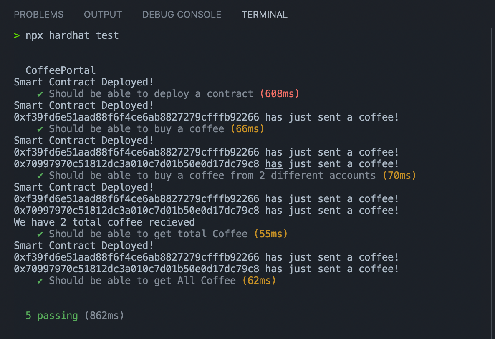
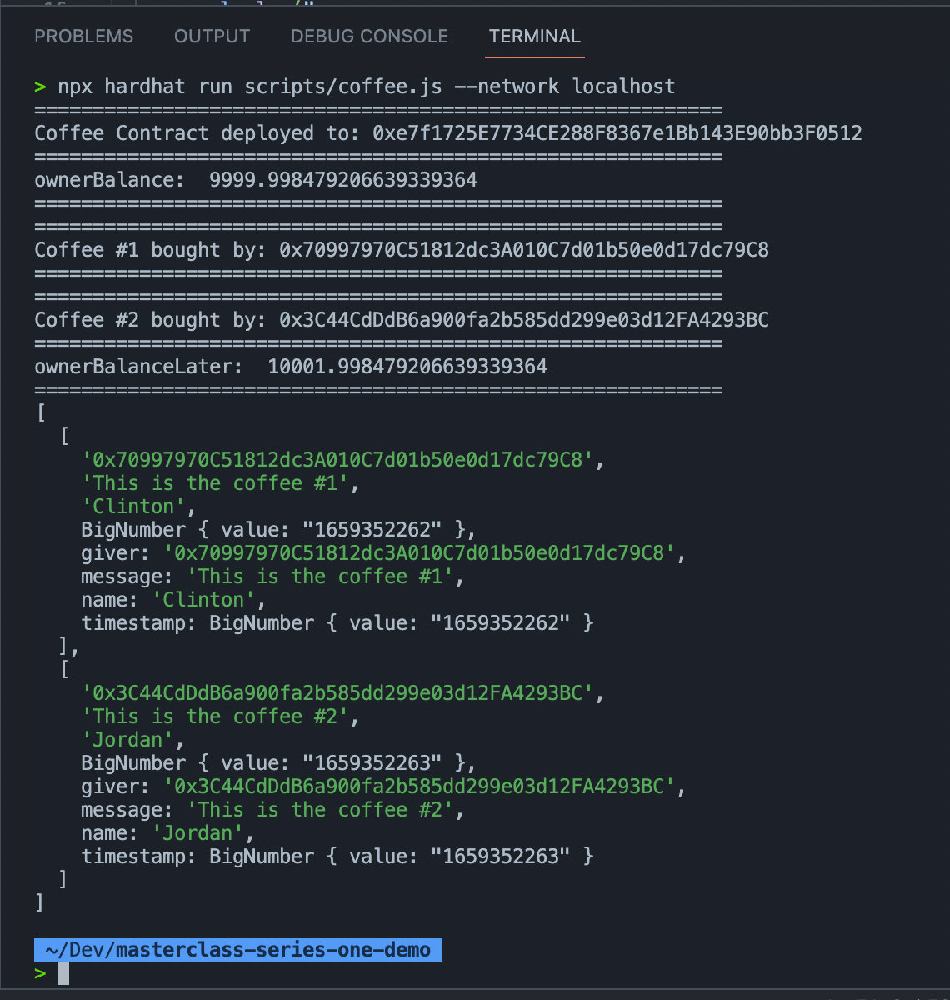

# Series 1: Mara Blockchain Masterclass - Nigeria

This workshop is targeted at developers who are transitioning from Web2 to Web3 or have just recently gotten into Web3 and are looking to have a well-rounded foundation.

This first workshop is Series 1 in the three-part series that aims to introduce you to the blockchain and how to build on the blockchain.


## Steps to set up a project, build and deploy a smart contract.

### Step 1
Let's ensure we have Node/NPM installed on our PC. If we don't have it installed, head over [here](https://nodejs.org/en/) for a guide.

### Step 2
Let's run the following command:

```
npm init -y
npm install --save-dev hardhat
```

Next, let's get a sample project by running the command below:

```
npx hardhat
```

We'll go with the following options:

- A JavaScript project.
- Accept all other requests.
  



> Installing `hardhat-waffle` and `hardhat-ethers` is required for the sample project.

**Just in case it didn't install automatically, we will install this other requirement with the following command:**

```
npm install --save-dev @nomiclabs/hardhat-waffle ethereum-waffle chai @nomiclabs/hardhat-ethers ethers @openzeppelin/contracts
```

To make sure everything is working, let us run the command below.

```
npx hardhat test
```
We will see a passed test result in our console.



### Step 3

It is now okay for us to delete `Lock.js` from the `test` folder and delete `deploy.js` from the scripts directory. 
After that, go to `contracts` folder and delete `Lock.sol`.

> The folders themselves should not be deleted!

We'll create a CoffeePortal.sol file inside the `contracts` directory. When using Hardhat, file layout is crucial, so pay attention! 

We're going to start with the basic structure of every contract.

```
// SPDX-License-Identifier: UNLICENSED

pragma solidity ^0.8.9;

// Import this file to use console.log
import "hardhat/console.sol";

contract CoffeePortal {

     constructor() {
        console.log("CoffeePortal deployed!");
     }
}
```

To test our smart contract, we will navigate to the `test` folder, create a new `coffee-test.js` file, and update it with the following code snippet:

```
const { expect } = require("chai");

describe("CoffeePortal", function () {

    it("Should be able to deploy a contract", async function () {
        const  CoffeePortal = await ethers.getContractFactory("CoffeePortal");
        const coffeePortal = await CoffeePortal.deploy();
        expect(coffeePortal.address).to.be.a("string");
    });
});
```

## Step 4

We have successfully build and test the demo(starter) smart contract in the previous step, Let us deploy it to a local network.

Inside the `scripts` folder, we will create a `deploy.js` file. Add the following code snippet.


```
// We require the Hardhat Runtime Environment explicitly here. This is optional
// but useful for running the script in a standalone fashion through `node <script>`.
//
// You can also run a script with `npx hardhat run <script>`. If you do that, Hardhat
// will compile your contracts, add the Hardhat Runtime Environment's members to the
// global scope, and execute the script.

const main = async () => {
  const [deployer] = await hre.ethers.getSigners();
  const accountBalance = await deployer.getBalance();

  console.log("Deploying contracts with account: ", deployer.address);
  console.log("Account balance: ", accountBalance.toString());

  // Deploy the contract
  const coffeeContractFactory = await hre.ethers.getContractFactory("CoffeePortal");
  const coffeeContract = await coffeeContractFactory.deploy();

  await coffeeContract.deployed(); // Await contract to be deployed

  console.log("Portal address: ", coffeeContract.address);
};

const runMain = async () => {
  try {
    await main();
    process.exit(0);
  } catch (error) {
    console.error(error);
    process.exit(1);
  }
};

runMain();
```

Before deploying, let us ensure we have our local node up and running in a separate terminal with the following command.

```
npx hardhat node
```

Next, we will deploy our smart contract.

```
npx hardhat run scripts/deploy.js --network localhost
```



## Step 5

Building the CoffeePortal(`BuyMeACoffee`) smart contract,

Lt us update the `CoffeePortal.sol` with the following code snippet.

```
// SPDX-License-Identifier: UNLICENSED

pragma solidity ^0.8.9;

// Import this file to use console.log
import "hardhat/console.sol";

contract CoffeePortal {
    uint256 totalCoffee;

    address payable public owner; 

    /*
     * A little magic, Events in Solidity!
     */

    event NewCoffee(
        address indexed from,
        uint256 timestamp,
        string message,
        string name
    );

    constructor() payable {
        console.log("Smart Contract Deployed!");

        // user who is calling this function address
        owner = payable(msg.sender);
    }

    /*
     * Create a struct here named Coffee.
     * A struct is basically a custom datatype where we can customize what we want to hold inside it.
     */
    struct Coffee {
        address giver; // The address of the user who buys me a coffee.
        string message; // The message the user sent.
        string name; // The name of the user who buys me a coffee.
        uint256 timestamp; // The timestamp when the user buys me a coffee.
    }

    /*
     * Declare variable coffee that lets me store an array of structs.
     * This is what hold all the coffee anyone has ever sends to me!
     */
    Coffee[] coffee;


    /*
     * Added a function getAllCoffee which will return the struct array, coffee, to us.
     * This will make it easy to retrieve the coffee from our website!
     */
    function getAllCoffee() public view returns (Coffee[] memory) {
        return coffee;
    }


    // Get All coffee bought
    function getTotalCoffee() public view returns (uint256) {
        // Optional: Add this line if you want to see the contract print the value!
        // We'll also print it over in run.js as well.
        console.log("We have %d total coffee recieved ", totalCoffee);
        return totalCoffee;
    }

    /*
     * Function to buy a coffee
     */
    function buyCoffee(string memory _message, string memory _name) public payable {

        // Must accept more than 0 ETH for a coffee.
        require(msg.value > 0, "can't buy coffee for free!");

        // Add one coffe to he total coffee bought
        totalCoffee += 1;

        console.log("%s has just sent a coffee!", msg.sender);

        /*
         * Store the coffee data in the array.
         */
        coffee.push(Coffee(msg.sender, _message, _name, block.timestamp));

        // Send the coffee Eth to the owner of the contract.
        owner.transfer(address(this).balance);

        emit NewCoffee(msg.sender, block.timestamp, _message, _name);
    }
}

```

## Step 6 

Writing test for our smart contract. Add the following code snippet.


```

const { expect } = require("chai");


describe("CoffeePortal", function () {

    it("Should be able to deploy a contract", async function () {
        const  CoffeePortal = await ethers.getContractFactory("CoffeePortal");
        const coffeePortal = await CoffeePortal.deploy();
        expect(coffeePortal.address).to.be.a("string");
    });

    it("Should be able to buy a coffee", async function () {
        const  CoffeePortal = await ethers.getContractFactory("CoffeePortal");
        const coffeePortal = await CoffeePortal.deploy();
        const [giver1] = await ethers.getSigners();
        const coffeeTxn1 = await coffeePortal.connect(giver1).buyCoffee(
            "This is the coffee #1",
            "Clinton",
            {
                value: ethers.utils.parseEther("1"),
            }
        );
        await coffeeTxn1.wait();
        expect(coffeeTxn1.hash).to.be.a("string");
    });

    it("Should be able to buy a coffee from 2 different accounts", async function () {
        const  CoffeePortal = await ethers.getContractFactory("CoffeePortal");
        const coffeePortal = await CoffeePortal.deploy();
        const [giver1, giver2] = await ethers.getSigners();
        const coffeeTxn1 = await coffeePortal.connect(giver1).buyCoffee(
            "This is the coffee #1",
            "Clinton",
            {
                value: ethers.utils.parseEther("1"),
            }
        );
        await coffeeTxn1.wait();
        expect(coffeeTxn1.hash).to.be.a("string");
        const coffeeTxn2 = await coffeePortal.connect(giver2).buyCoffee(
            "This is the coffee #2",
            "Jordan",
            {
                value: ethers.utils.parseEther("1"),
            }
        );
        await coffeeTxn2.wait();
        expect(coffeeTxn2.hash).to.be.a("string");
    });

    it("Should be able to get total Coffee", async function () {
        const  CoffeePortal = await ethers.getContractFactory("CoffeePortal");
        const coffeePortal = await CoffeePortal.deploy();
        const [giver1, giver2] = await ethers.getSigners();
        const coffeeTxn1 = await coffeePortal.connect(giver1).buyCoffee(
            "This is the coffee #1",
            "Clinton",
            {
                value: ethers.utils.parseEther("1"),
            }
        );
        await coffeeTxn1.wait();
        expect(coffeeTxn1.hash).to.be.a("string");
        const coffeeTxn2 = await coffeePortal.connect(giver2).buyCoffee(
            "This is the coffee #2",
            "Jordan",
            {
                value: ethers.utils.parseEther("1"),
            }
        );
        await coffeeTxn2.wait();
        expect(coffeeTxn2.hash).to.be.a("string");
        const totalCoffee = await coffeePortal.getTotalCoffee();
        expect(totalCoffee).to.equal(2);
    });

    it("Should be able to get All Coffee", async function () {
        const  CoffeePortal = await ethers.getContractFactory("CoffeePortal");
        const coffeePortal = await CoffeePortal.deploy();
        const [giver1, giver2] = await ethers.getSigners();
        const coffeeTxn1 = await coffeePortal.connect(giver1).buyCoffee(
            "This is the coffee #1",
            "Clinton",
            {
                value: ethers.utils.parseEther("1"),
            }
        );
        await coffeeTxn1.wait();
        expect(coffeeTxn1.hash).to.be.a("string");
        const coffeeTxn2 = await coffeePortal.connect(giver2).buyCoffee(
            "This is the coffee #2",
            "Jordan",
            {
                value: ethers.utils.parseEther("1"),
            }
        );
        await coffeeTxn2.wait();
        expect(coffeeTxn2.hash).to.be.a("string");
        const allCoffee = await coffeePortal.getAllCoffee();
        expect(allCoffee).to.be.a("array");
        expect(allCoffee.length).to.equal(2);
    });

});
```

Let us run the command below, to test our contract.

```
npx hardhat test
```



## Step 7

let us proceed to deploy and test(simulating frontend test) our smart contract in a local node.

Inside the `scripts` folder, we will create a `coffee.js` file and then add the following code snippet.

```
const main = async () => {
    // Get the example accounts we'll be working with.
    const [owner, giver1, giver2] = await hre.ethers.getSigners();


    const coffeeContractFactory = await hre.ethers.getContractFactory(
      "CoffeePortal"
    );
    const coffeeContract = await coffeeContractFactory.deploy();

    console.log("===========================================================");
    
    await coffeeContract.deployed();
    console.log("Coffee Contract deployed to:", coffeeContract.address);
  
    console.log("===========================================================");

    /*
     * Get Owner balance
     */
    let ownerBalance = await hre.ethers.provider.getBalance(
      owner.address
    );
    console.log(
      "ownerBalance: ",
      hre.ethers.utils.formatEther(ownerBalance)
    );

    console.log("===========================================================");
    /*
     * Let's try to buy two coffees from 2 different accounts a coffee
     */
    const coffeeTxn1 = await coffeeContract.connect(giver1).buyCoffee(
      "This is the coffee #1",
      "Clinton",
    {
        value: hre.ethers.utils.parseEther("1"),
    }
    );
    await coffeeTxn1.wait();


    console.log("===========================================================");
    console.log("Coffee #1 bought by:", giver1.address);
    console.log("===========================================================");

    // Buy a coffee from giver2
    const coffeeTxn2 = await coffeeContract.connect(giver2).buyCoffee(
        "This is the coffee #2",
        "Jordan",
      {
          value: hre.ethers.utils.parseEther("1"),
      }
      );

    await coffeeTxn2.wait();
    console.log("===========================================================");
    console.log("Coffee #2 bought by:", giver2.address);
    console.log("===========================================================");
    
    /*
     * Get Owner balance
     */
      let ownerBalanceResult = await hre.ethers.provider.getBalance(
        owner.address
      );
      console.log(
        "ownerBalanceLater: ",
        hre.ethers.utils.formatEther(ownerBalanceResult)
      );
  
    console.log("===========================================================");
  
    let allCoffee = await coffeeContract.getAllCoffee();
    console.log(allCoffee);
  };
  
  const runMain = async () => {
    try {
      await main();
      process.exit(0);
    } catch (error) {
      console.log(error);
      process.exit(1);
    }
  };
  
  runMain();
```

Next, we will deploy our DeFi smart contract.

```
npx hardhat run scripts/coffee.js --network localhost
```



We just wrote, test and deploy our contract. 🥳🥳🥳


## What's Next?

Building a DApp.

See you in the next Series!!!